# 🌟 Awesome Skills Management

<p align="center">
  <a href="https://github.com/ishandutta2007/Awesome-Awesome-Awesome"></a><a href="https://discord.gg/jc4xtF58Ve"></a>
  <a href="https://github.com/ishandutta2007/Awesome-Skills-Management/stargazers"></a>
  <a href="https://github.com/ishandutta2007/Awesome-Skills-Management/network/members"></a>
  <a href="https://github.com/ishandutta2007/Awesome-Skills-Management/issues"></a>
  <a href="https://github.com/ishandutta2007/Awesome-Skills-Management/blob/main/LICENSE"></a>
  <a href="https://github.com/ishandutta2007"></a>
</p>

<p align="center">
  
</p>

> 🎯 **A curated directory of top SaaS platforms and open-source GitHub projects for Skills Intelligence, Competency Management, Internal Talent Marketplaces, Skill Taxonomies, Workforce Planning, Career Pathing, and AI-Powered Talent Mobility.**

*Last updated: September 2026*

---

## 📖 Overview & Ecosystem Intelligence

Modern organizations are shifting from rigid job-title architectures toward agile, **skills-based organizations (SBO)**. Skills management systems help enterprises identify, map, validate, infer, develop, and deploy workforce capabilities across full-time employees, contractors, agile teams, and evolving roles. 

### 🔑 Key Functional Capabilities:
- ⚡ **Skills Intelligence & Ontologies:** Semantic skill extraction from resumes, job requisitions, performance evaluations, and project outputs.
- 🧩 **Competency Frameworks & Taxonomies:** Standardized hierarchical frameworks (e.g., ESCO, O*NET, Lightcast Open Skills) aligned to business units.
- 🚀 **Internal Talent Marketplaces (ITM):** Dynamic AI matching of talent to open projects, gig assignments, mentoring opportunities, and promotions.
- 📊 **Skills Gap & Workforce Analytics:** Quantitative heatmaps of organizational skill shortages and predictive workforce readiness modeling.
- 🎯 **Personalized Career Pathing & L&D:** Dynamic learning recommendations connected to verifiable badges, credentials, and career aspirations.

---

## 📑 Table of Contents

- [🏢 SaaS/Hosted Platforms](#-saashosted-platforms)
- [💻 Open-Source GitHub Projects](#-open-source-github-projects)
- [🛠️ Architectural Blueprints for Custom Platforms](#️-architectural-blueprints-for-custom-platforms)
- [🤝 How to Contribute](#-how-to-contribute)
- [📈 Star History](#-star-history)
- [⚖️ Disclaimer](#️-disclaimer)

---

## 🏢 SaaS/Hosted Platforms

> 📊 **Estimated Market Size & Structure:** The global Skills Management and AI Talent Intelligence software market is estimated at **~$4.2 Billion** (2025/2026) and is forecasted to surpass **$10.5 Billion by 2030** (CAGR of **~16.5%**). The sector exhibits **moderate fragmentation with dual-tier consolidation**—legacy HCM market leaders (Oracle, SAP, Workday) anchor core enterprise HR systems of record, while specialized AI talent marketplaces and skills inference engines (Eightfold, Gloat, TechWolf) lead dynamic capability graphs without a winner-take-all monopoly, driving API-first ecosystem interoperability.

*The table below is sorted by **Company Size (Valuation / Market Capitalization / Annual Revenue)** in descending order.*

| 🏢 Product / Platform | 💼 Company Size (Valuation / Revenue) | 📝 Description | 💵 Pricing (Starting Tiers) | 🎁 Free Tier / Trial Limits |
| :--- | :--- | :--- | :--- | :--- |
| **Oracle Fusion Cloud HCM** | ~$420 Billion Market Cap (Oracle Corp) / ~$53B Annual Revenue | Enterprise HCM platform supporting dynamic skills inventories, talent management, recruiting, learning, career pathing, and AI-assisted HR workflows. | Starting at ~$15–$30 / employee / month (typically requires 1,000-user minimum & 3-year agreement) | No free-forever plan or trial for Fusion HCM suite (free tier limited to 30-day $300 credit on underlying Oracle Cloud Infrastructure / OCI) |
| **SAP SuccessFactors** | ~$240 Billion Market Cap (SAP SE) / ~$35B Annual Revenue | Enterprise human capital management platform supporting talent acquisition, learning, competency management, succession planning, and workforce agility. | Starting at ~$6–$10 / employee / month for individual modules (~$18–$38 PEPM for full talent suites) | No free-forever plan; 30-day test-drive / demo environment available for enterprise evaluations |
| **SAP Talent Intelligence Hub** | ~$240 Billion Market Cap (SAP Ecosystem) / ~$35B Annual Revenue | Centralized SAP capability connecting employee skills, competencies, experiences, and talent data directly across all HR workflows. | Included with SAP SuccessFactors HCM enterprise subscriptions (starts at ~$18–$38 PEPM base licensing) | No separate free tier; accessible within SAP SuccessFactors 30-day enterprise evaluation tenant |
| **LinkedIn Talent Insights** | ~$3.1 Trillion Parent Market Cap (Microsoft) / ~$15B+ LinkedIn Unit Revenue | Big-data workforce intelligence platform providing global labor-market insights, supply/demand trends, and peer benchmarking for skills planning. | Starting at ~$6,000–$9,500 / seat / year (annual enterprise license) | No free-forever plan; 0-day self-serve trial (guided walkthrough and customized market sample report via LinkedIn consultant) |
| **Workday Skills Cloud** | ~$75 Billion Market Cap / ~$8.2B Annual Revenue | Universal skills foundation within the Workday HCM ecosystem leveraging machine learning to automatically infer, align, and clean workforce skills data. | Starting at ~$3–$6 / employee / month add-on (requires base Workday HCM license starting at ~$40–$60 PEPM) | No free-forever plan; 30-day free trial limited strictly to Workday Adaptive Planning (core HCM/Skills Cloud available via guided customer sandbox) |
| **Cornerstone OnDemand** | $5.2 Billion Valuation (Acquired by Clearlake Capital) / ~$900M+ ARR | Comprehensive talent experience and learning platform powering workforce skills development, competency frameworks, performance, and talent mobility. | Learning module starting at ~$3.50–$8.00 / user / month; Full Suite ~$8.00–$25.00 / user / month | No free-forever plan; 0-day self-serve trial (custom guided demo sandbox provided upon request) |
| **Cornerstone Skills Graph** | $5.2 Billion Valuation (Cornerstone Suite) / ~$900M+ ARR | AI-powered skills engine and ontology mapping billions of skills data points to roles, learning content, and career paths across the enterprise. | Starting at ~$2–$4 / user / month add-on (requires Cornerstone LMS/Talent suite starting at ~$3.50–$8 / user / month) | No free-forever plan; 0-day self-serve trial (guided interactive sandbox provided on request) |
| **Eightfold AI** | $2.1 Billion Valuation (Series E Unicorn) / ~$100M+ ARR | Deep learning talent intelligence platform for skills-based hiring, employee retention, internal mobility, workforce planning, and bias reduction. | Starting at ~$7–$10 / employee / month (annual contract based on employee headcount) | No free-forever plan; 0-day self-serve trial (guided live demo & pilot assessment on request) |
| **Phenom** | $1.4 Billion Valuation (Series D Unicorn) / ~$100M+ ARR | AI-powered talent experience platform delivering personalized skills matching for candidates, employees, recruiters, and managers. | Starting at ~$7–$13 / employee / month (annual subscription based on selected modules & workforce scale) | No free-forever plan; 0-day self-serve trial (personalized live demo and ROI assessment upon consultation) |
| **Degreed** | $1.4 Billion Valuation (Series D Unicorn) / ~$100M+ ARR | Enterprise learning experience and capability development platform focused on real-time skills profiles, learning pathways, and workforce upskilling. | Free for individuals; Enterprise plans starting at ~$3–$6 / user / month (billed annually) | Free-forever plan for individuals (unlimited skill tracking, personal profile creation, and Degreed Open Library access); 0-day trial for Enterprise |
| **Gloat** | ~$1.0 Billion Valuation (Series D Unicorn) / ~$50M+ ARR | Pioneering AI internal talent marketplace connecting employees to projects, gigs, mentorships, and full-time roles based on real-time skills data. | Starting at ~$5–$10 / employee / month (PEPM; annual contract scaled by workforce size) | No free-forever plan; 0-day self-serve trial (custom enterprise interactive demo & sandbox on request) |
| **Beamery** | ~$1.0 Billion Valuation (Series D Unicorn) / ~$50M+ ARR | Talent lifecycle and workforce intelligence platform supporting autonomous skills clustering, career progression, and talent acquisition. | Starting at ~$75–$150 / user / month for talent acquisition seats (enterprise workforce contracts starting at ~$50,000 / year) | No free-forever plan; 0-day self-serve trial (tailored talent architecture demo on request) |
| **Lightcast** | ~$700 Million Valuation (KKR-backed) / ~$100M+ ARR | Authoritative global labor-market analytics platform providing dynamic skills taxonomies, compensation benchmarking, and job requisition data. | Starting at ~$2,500 / year (or £2,000 / year for single-seat integrations; enterprise analyst suites ~$15,000–$30,000 / year) | Free-forever open access to browse Open Skills Taxonomy online; 30-day trial / sample dataset access via Snowflake Marketplace & AWS Data Exchange |
| **Skillsoft CAISY** | ~$200 Million Market Cap (NYSE: SKIL) / ~$550M Annual Revenue | Generative AI simulation coach within Skillsoft Percipio designed to practice leadership, interpersonal skills, and technical workplace scenarios. | Starting at $19.99 / month or $199 / year for individuals; Enterprise Percipio starting at ~$3–$5 / user / month | No free-forever plan; 14-day to 30-day free trial on Skillsoft Percipio (full access to AI simulation modules including CAISY and selected learning paths) |
| **TechWolf** | ~$180 Million Valuation (€42.7M Series B) / Backed by SAP & ServiceNow | AI infrastructure platform that connects enterprise data sources to automatically construct a continuous, real-time employee skills inventory. | Starting at ~$40,000 / year base enterprise subscription (scaled by employee volume) | No free-forever plan; 0-day self-serve trial (guided skills data audit & POC sandbox upon consultation) |
| **Fuel50** | ~$150 Million Valuation ($40M+ Venture Funding) / ~$20M ARR | Next-generation career pathing and talent marketplace platform empowering employee-driven skill development and transparent career navigation. | Starting at ~$4.54 / user / year (~$6–$10 / employee / month for full enterprise suites) | No free-forever plan; 0-day self-serve trial (guided proof-of-concept evaluation on request) |
| **Retrain.ai** | ~$100 Million Valuation ($34M+ Venture Funding) | Responsible AI talent intelligence platform optimizing workforce skills mapping, job architecture rationalization, and proactive reskilling. | Starting at ~$6–$9 / employee / month (annual enterprise contract) | No free-forever plan; 0-day self-serve trial (custom pilot environment & skills gap analysis on request) |
| **SkyHive** | ~$90 Million Valuation ($40M+ Venture Funding; Acquired by Cornerstone) | Quantum labor analytics and skills intelligence engine generating real-time job-to-skill normalization and workforce automation impact models. | Starting at ~$25,000 / year base or ~$5–$9 / employee / month | No free-forever plan; 0-day self-serve trial (custom enterprise discovery session & labor market benchmark report on request) |
| **365Talents** | ~$60 Million Valuation (€10M+ Venture Funding) | European AI-powered talent marketplace and internal mobility platform supporting multi-lingual skills extraction and career pathing. | Starting at ~$4–$7 / employee / month (annual contract based on headcount) | No free-forever plan; 0-day self-serve trial (tailored organizational pilot provided on request) |
| **Neobrain** | ~$50 Million Valuation (€20M+ Venture Funding) | AI talent management solution focused on strategic workforce planning, skills anticipation, performance reviews, and mobility matching. | Starting at ~$5–$8 / employee / month (annual subscription per module) | No free-forever plan; 14-day guided proof-of-concept trial upon request |
| **AG5** | ~$40 Million Valuation (€6M+ Series A Funding) | Specialized skills management software for frontline and operational teams featuring visual skills matrices, audit compliance, and gap tracking. | Starting at ~$2–$4 / employee / month (billed annually; Core tier) | No free-forever plan; 14-day free trial (includes full access to skills matrix builder and onboarding templates) |

---

## 💻 Open-Source GitHub Projects

Open-source tools provide the essential building blocks for engineering self-hosted skills taxonomies, resume parsers, competency ontologies, vector matching pipelines, and custom internal talent marketplaces.

*The list below is sorted by **GitHub Star Count** in descending order.*

1. **[Hugging Face Transformers](https://github.com/huggingface/transformers)** <a href="https://github.com/huggingface/transformers/stargazers"></a>  
   *State-of-the-art Machine Learning library for PyTorch and TensorFlow used to train and run custom NLP models for skill extraction, role categorization, and resume parsing.*

2. **[LangChain](https://github.com/langchain-ai/langchain)** <a href="https://github.com/langchain-ai/langchain/stargazers"></a>  
   *Framework for developing context-aware LLM agents that query employee skills databases, generate career coaching advice, and reason across talent graphs.*

3. **[Grafana](https://github.com/grafana/grafana)** <a href="https://github.com/grafana/grafana/stargazers"></a>  
   *Open-source platform for monitoring, visualization, and workforce metrics/analytics dashboards.*

4. **[Apache Superset](https://github.com/apache/superset)** <a href="https://github.com/apache/superset/stargazers"></a>  
   *Enterprise-grade business intelligence tool ideal for building organizational competency matrices, skill-gap heatmaps, and executive workforce dashboards.*

5. **[Odoo Community Edition](https://github.com/odoo/odoo)** <a href="https://github.com/odoo/odoo/stargazers"></a>  
   *Extensible open-source ERP with integrated HR, recruitment, appraisal, and employee skill modules customizable for organizational competency mapping.*

6. **[Metabase](https://github.com/metabase/metabase)** <a href="https://github.com/metabase/metabase/stargazers"></a>  
   *Self-hosted business intelligence and data visualization suite for analyzing employee skill distributions, course completions, and internal hiring metrics.*

7. **[Apache Airflow](https://github.com/apache/airflow)** <a href="https://github.com/apache/airflow/stargazers"></a>  
   *Programmatic workflow orchestration platform for scheduling automated ETL pipelines that synchronize HRIS records, job postings, and external labor taxonomies.*

8. **[Milvus](https://github.com/milvus-io/milvus)** <a href="https://github.com/milvus-io/milvus/stargazers"></a>  
   *Cloud-native open-source vector database built for massive-scale semantic similarity search between employee skill vectors and job requisitions.*

9. **[ERPNext](https://github.com/frappe/erpnext)** <a href="https://github.com/frappe/erpnext/stargazers"></a>  
   *Comprehensive open-source ERP system featuring built-in human resource modules for employee competencies, certification tracking, training programs, and performance.*

10. **[Keycloak](https://github.com/keycloak/keycloak)** <a href="https://github.com/keycloak/keycloak/stargazers"></a>  
    *Open-source Identity and Access Management providing SSO, OAuth2, and granular role-based permissions to secure sensitive employee skills and appraisal data.*

11. **[Qdrant](https://github.com/qdrant/qdrant)** <a href="https://github.com/qdrant/qdrant/stargazers"></a>  
    *High-performance vector search engine written in Rust for semantic skill matching, candidate recommendation engines, and profile embeddings.*

12. **[spaCy](https://github.com/explosion/spaCy)** <a href="https://github.com/explosion/spaCy/stargazers"></a>  
    *Industrial-strength NLP library in Python for building named entity recognition (NER) pipelines that extract skills, credentials, and job titles from CVs.*

13. **[Chroma](https://github.com/chroma-core/chroma)** <a href="https://github.com/chroma-core/chroma/stargazers"></a>  
    *AI-native embedding database engineered for developer simplicity when indexing resumes, job postings, and competency vectors for semantic talent search.*

14. **[MLflow](https://github.com/mlflow/mlflow)** <a href="https://github.com/mlflow/mlflow/stargazers"></a>  
    *Open-source machine learning lifecycle platform for tracking, evaluating, and deploying skills classification and talent recommendation algorithms.*

15. **[Haystack](https://github.com/deepset-ai/haystack)** <a href="https://github.com/deepset-ai/haystack/stargazers"></a>  
    *End-to-end framework for building production-ready search and question-answering systems over corporate skill inventories and training documents.*

16. **[Prefect](https://github.com/PrefectHQ/prefect)** <a href="https://github.com/PrefectHQ/prefect/stargazers"></a>  
    *Modern data workflow orchestration platform for managing reactive pipelines that extract skills from updated CVs and refresh competency ontologies.*

17. **[Sentence Transformers](https://github.com/UKPLab/sentence-transformers)** <a href="https://github.com/UKPLab/sentence-transformers/stargazers"></a>  
    *Python framework for state-of-the-art sentence, text, and image embeddings—essential for semantic distance matching between employee skills and job requisitions.*

18. **[Neo4j Community Edition](https://github.com/neo4j/neo4j)** <a href="https://github.com/neo4j/neo4j/stargazers"></a>  
    *Graph database technology ideal for representing multi-dimensional knowledge graphs connecting people, competencies, certifications, roles, and mentors.*

19. **[Flair](https://github.com/flairNLP/flair)** <a href="https://github.com/flairNLP/flair/stargazers"></a>  
    *State-of-the-art NLP library for contextual string embeddings and Named Entity Recognition used in parsing complex, multi-word skill phrases.*

20. **[OpenSearch](https://github.com/opensearch-project/OpenSearch)** <a href="https://github.com/opensearch-project/OpenSearch/stargazers"></a>  
    *Scalable search and analytics suite offering hybrid lexical and k-NN vector search across employee profiles, project portfolios, and skills catalogs.*

21. **[Frappe HR](https://github.com/frappe/hrms)** <a href="https://github.com/frappe/hrms/stargazers"></a>  
    *Modern open-source HR and payroll platform with employee profiles, training management, appraisals, and customizable skill matrices.*

22. **[Open edX Platform](https://github.com/openedx/edx-platform)** <a href="https://github.com/openedx/edx-platform/stargazers"></a>  
    *Enterprise-grade learning platform supporting competency-based course delivery, student progress tracking, and verifiable learning assessments.*

23. **[BERTopic](https://github.com/MaartenGr/BERTopic)** <a href="https://github.com/MaartenGr/BERTopic/stargazers"></a>  
    *Transformer-based topic modeling technique to discover and cluster emerging technologies and trending skills from unstructured job advertisements.*

24. **[Moodle](https://github.com/moodle/moodle)** <a href="https://github.com/moodle/moodle/stargazers"></a>  
    *Leading open-source learning management system with full support for competency frameworks, learning plans, evidence validation, and skill badges.*

25. **[Canvas LMS](https://github.com/instructure/canvas-lms)** <a href="https://github.com/instructure/canvas-lms/stargazers"></a>  
    *Popular LMS supporting learning outcomes, rubric-based grading, mastery calculations, and modular credentials.*

26. **[Apache AGE](https://github.com/apache/age)** <a href="https://github.com/apache/age/stargazers"></a>  
    *PostgreSQL graph extension allowing organizations to query complex skills networks using openCypher directly alongside relational employee tables.*

27. **[RapidFuzz](https://github.com/maxbachmann/RapidFuzz)** <a href="https://github.com/maxbachmann/RapidFuzz/stargazers"></a>  
    *Ultra-fast fuzzy string matching library in C++ and Python for deduplicating and normalizing variations in skill names and certifications.*

28. **[OrangeHRM Open Source](https://github.com/orangehrm/orangehrm)** <a href="https://github.com/orangehrm/orangehrm/stargazers"></a>  
    *Widely adopted open-source human resource management application supporting employee records, certifications, and talent evaluation workflows.*

29. **[PyResparser](https://github.com/OmkarPathak/pyresparser)** <a href="https://github.com/OmkarPathak/pyresparser/stargazers"></a>  
    *Python library for parsing resumes and CVs to automatically extract skills, education history, and experience tokens.*

30. **[OCA HR Modules](https://github.com/OCA/hr)** <a href="https://github.com/OCA/hr/stargazers"></a>  
    *Community-maintained Odoo extensions providing advanced employee appraisals, training management, and skills matrix views.*

31. **[Skills-ML](https://github.com/workforce-data-initiative/skills-ml)** <a href="https://github.com/workforce-data-initiative/skills-ml/stargazers"></a>  
    *Open-source machine learning library designed for analyzing skills, competencies, and occupations in labor-market datasets.*

32. **[OpenHRMS](https://github.com/CybroOdoo/OpenHRMS)** <a href="https://github.com/CybroOdoo/OpenHRMS/stargazers"></a>  
    *Open-source human resource management suite providing modular employee skill tracking, onboarding, and performance evaluations.*

33. **[Nesta Skills Extractor Library](https://github.com/nestauk/ojd_daps_skills)** <a href="https://github.com/nestauk/ojd_daps_skills/stargazers"></a>  
    *NLP library developed by Nesta to extract skill entities from free-text job adverts and map them against the European ESCO taxonomy.*

34. **[Mahara ePortfolio](https://github.com/MaharaProject/mahara)** <a href="https://github.com/MaharaProject/mahara/stargazers"></a>  
    *Open-source digital portfolio and competency framework system for employees and learners to collect and showcase validated evidence of mastery.*

35. **[Nesta Skills Taxonomy v2](https://github.com/nestauk/skills-taxonomy-v2)** <a href="https://github.com/nestauk/skills-taxonomy-v2/stargazers"></a>  
    *Data-driven skills taxonomy codebase and analysis framework built from millions of online job adverts.*

36. **[Open Skills API](https://github.com/workforce-data-initiative/open-skills-api)** <a href="https://github.com/workforce-data-initiative/open-skills-api/stargazers"></a>  
    *Standardized REST API and data store for querying relationships between skills, tools, knowledge areas, and occupations.*

37. **[ESCO Skill Extractor](https://github.com/k-paxian/esco-skill-extractor)** <a href="https://github.com/k-paxian/esco-skill-extractor/stargazers"></a>  
    *Python library that maps unstructured job descriptions and profiles to European ESCO skills using semantic similarity.*

38. **[PuzzleSkills](https://github.com/puzzle/skills)** <a href="https://github.com/puzzle/skills/stargazers"></a>  
    *Open-source web application for tracking employee skills, CV generation, and team capability overviews.*

39. **[Core-O Competence Ontology](https://github.com/jpalmeida/competence-ontology)** <a href="https://github.com/jpalmeida/competence-ontology/stargazers"></a>  
    *Reference ontology for modeling human competences, occupational requirements, proficiency grades, and skills evolution over time.*

---

## 🛠️ Architectural Blueprints for Custom Platforms

Organizations building sovereign, private skills management and talent marketplace platforms can combine open-source modules into a full-stack architecture:

```
┌────────────────────────────────────────────────────────────────────────┐
│                        PRESENTATION & UI LAYER                         │
│   • PuzzleSkills / Custom React App   • Metabase / Apache Superset     │
└───────────────────────────────────┬────────────────────────────────────┘
                                    │
┌───────────────────────────────────▼────────────────────────────────────┐
│                       AI & SEMANTIC MATCHING LAYER                     │
│   • spaCy / Flair (NER Extraction)    • Sentence Transformers (Embed)  │
│   • LangChain (Reasoning Agents)      • Qdrant / Milvus / Chroma (DB)  │
└───────────────────────────────────┬────────────────────────────────────┘
                                    │
┌───────────────────────────────────▼────────────────────────────────────┐
│                    KNOWLEDGE GRAPH & ONTOLOGY LAYER                    │
│   • Neo4j / Apache AGE (Graph)        • ESCO / Open Skills Taxonomies  │
│   • PostgreSQL / pgvector             • Core-O Competence Model        │
└───────────────────────────────────┬────────────────────────────────────┘
                                    │
┌───────────────────────────────────▼────────────────────────────────────┐
│                     CORE HR & DATA PIPELINE LAYER                      │
│   • Frappe HR / ERPNext / Odoo        • Apache Airflow / Prefect (ETL) │
│   • Keycloak (SSO / RBAC Security)    • Moodle / Open edX (LMS / L&D)  │
└────────────────────────────────────────────────────────────────────────┘
```

---

## 🤝 How to Contribute

Contributions are warmly welcomed! To suggest a new SaaS platform, open-source repository, ontology framework, or research tool:

1. 🍴 **Fork the repository**.
2. 🌿 **Create a new branch**: `git checkout -b feature/add-skill-platform`
3. 📝 **Add your entry** in the corresponding section following the existing format:
   - For SaaS: Include name, company size/valuation, description, specific starting pricing tier, and free trial limit.
   - For Open-Source: Include name, official repository link with stargazers badge `<a href="https://github.com/owner/repo/stargazers"></a>`, and a factual 1–2 sentence description.
4. 🚀 **Submit a Pull Request** with a concise description of why the tool is valuable.
5. ⭐ **Star this repository** if you find it helpful for your workforce and skills management projects!

For broader Awesome collections, visit [Awesome Awesome Awesome](https://github.com/ishandutta2007/Awesome-Awesome-Awesome).

---

## 📈 Star History

[](https://star-history.dera.page/#ishandutta2007/Awesome-Skills-Management&type=date&legend=top-left)

---

## ⚖️ Disclaimer

*This repository is a community-curated directory intended solely for educational, architectural, and informational purposes. Mention of specific vendors, trademarks, or open-source projects does not constitute an endorsement.*

- **Human-in-the-Loop:** AI-based skills inference, resume parsing, and internal mobility recommendations can exhibit systemic bias or inferential errors; automated decisions impacting employee hiring, compensation, or termination should always be subject to appropriate human oversight.
- **Data Privacy & Governance:** Employee skills and workforce talent data often involve sensitive personally identifiable information (PII). Organizations should ensure compliance with relevant employment regulations, GDPR, and enterprise security governance.
